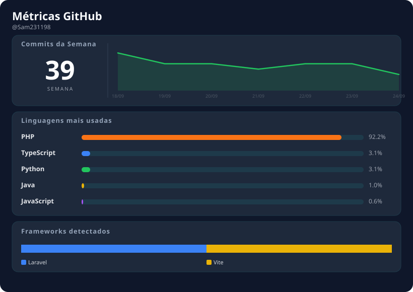

<h1 align="center">👋 Olá, eu sou Samuel Marques</h1>

  <b>Back-end Developer · PHP · Laravel · PostgreSQL</b> 
  Construindo APIs, pipelines de dados e sistemas escaláveis há 5+ anos. 
  Brasília, DF 🇧🇷

  
  

---

## 🧑‍💻 Sobre mim

- 💼 **Experiência:** Desenvolvedor Back-end com 5+ anos de atuação.
- 🎓 **Formação:** Bacharel em Sistemas de Informação pela Faculdade JK (2021).
- 📍 **Localização:** Brasília, DF (Disponível para oportunidades remotas).
- ⚙️ **Foco:** Arquitetura escalável, otimização de consultas e automação de processos.

---

## 🛠 Stack Técnica

### 🚀 Principais Tecnologias

  
  
  
  
  

### 🛠️ Outras Ferramentas & Linguagens
- **Linguagens:** JavaScript (ES6+), TypeScript, Python, Java.
- **Frameworks:** Node.js, Spring Boot, Vue.js, React.
- **Bancos:** MySQL, MariaDB, MongoDB.
- **DevOps:** GitHub Actions, Linux, Swagger, Postman.

---

## 📊 Estatísticas Dinâmicas

